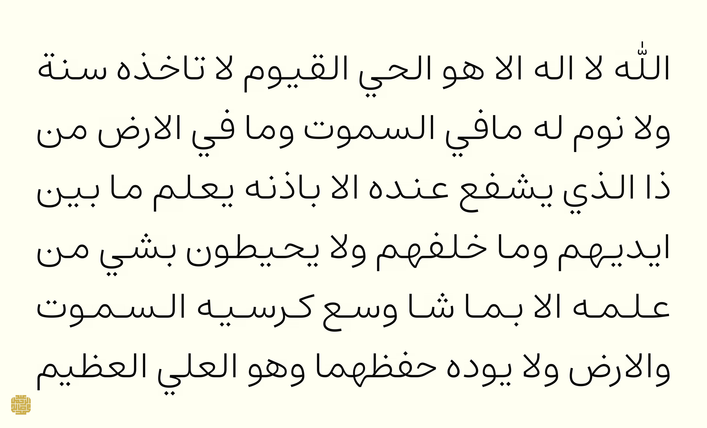

This small rust repo is me trying stuff with Arabic justification.

> [!NOTE]
> To use this with your own font and text, all the knobs to tweak are in [`nun.toml`](nun.toml). Note that if you keep variations empty, it will use spacing between words to justify the text.

You can find the ideas discussed in https://asibahi.github.io/thoughts/practical-arabic-justification/

Example outputs of this program can be found in the `/images` directory. This is one

---

This is [Raqq](https://aliftype.com/raqq/english) by @khaledhosny

---

This is [Estedad](https://github.com/aminabedi68/Estedad) by @aminabedi68

